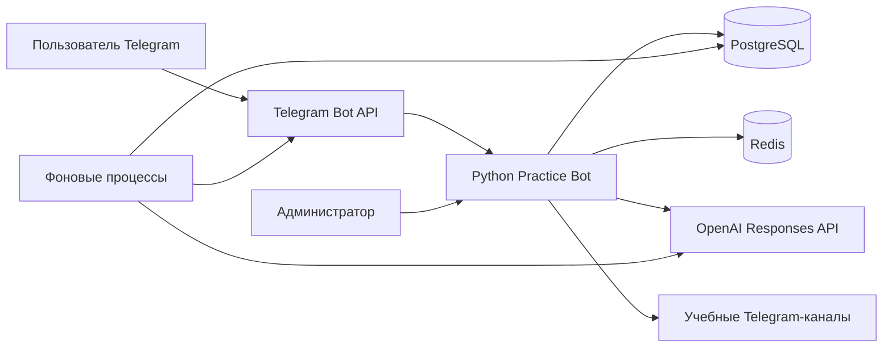

<div align="center">

# 🤖 Python Practice Bot

**Telegram-платформа для изучения Python через практические проекты, подсказки и AI-проверку решений.**

[Открыть бота](https://t.me/PythonPracticeRuBot) · [Посмотреть Demo-канал](https://t.me/PythonProjectsDemo)


</div>

## О проекте

Python Practice Bot помогает изучать Python на практике: пользователь выбирает курс, получает проекты, использует подсказки, отправляет решение и получает структурированную проверку от OpenAI.

Бот объединяет учебные проекты, систему опыта, платные подписки, закрытые Telegram-каналы и административную панель для управления контентом.

## Возможности

### Для учеников

- выбор курса и сохранение текущего учебного контекста;
- бесплатный Demo-курс;
- доступ к платным курсам по подписке;
- получение проектов из Telegram-каналов;
- последовательное открытие подсказок;
- отправка решений Python-файлом;
- предварительная проверка формата и синтаксиса решения;
- AI-проверка по обязательным критериям проекта;
- подробный результат проверки с замечаниями и рекомендациями;
- история отправленных решений;
- начисление XP за выполненные проекты;
- защита от повторного начисления XP;
- автоматическая оплата через Telegram Stars;
- альтернативная покупка подписки за рубли через администратора;
- получение ссылки на закрытый канал после активации подписки;
- уведомления об окончании подписки.

### Для администратора

- создание проектов и подсказок через пошаговые сценарии;
- планирование обычных публикаций, проектов и подсказок;
- просмотр очереди запланированных публикаций;
- перенос, отмена и немедленная публикация;
- подтверждение потенциально опасных действий;
- уведомления об ошибках публикации;
- блокировка следующих публикаций курса после ошибки;
- повторный запуск публикации после исправления;
- ручная выдача и отзыв подписок;
- просмотр проблемных платежей;
- повторная активация подписки после успешной оплаты;
- аудит изменений подписок.

## Как работает система



PostgreSQL хранит пользователей, курсы, проекты, попытки, платежи, подписки и публикации.

Redis используется для состояний диалогов Telegram-бота.

Фоновые процессы отвечают за:

- проверку решений;
- публикацию запланированных материалов;
- восстановление незавершённых платежей;
- завершение подписок и отзыв доступа к каналам.

## Надёжность

В проекте предусмотрены:

- идемпотентная обработка платежей;
- защита от повторной активации подписки;
- защита от повторного начисления XP;
- журнал событий подписок;
- восстановление зависших AI-проверок;
- восстановление незавершённых платежей;
- блокировка очереди публикаций после ошибки;
- безопасный перезапуск фоновых процессов;
- корректное завершение соединений с Telegram, Redis, PostgreSQL и OpenAI;
- уведомления администратора о критических ошибках.

## Технологии

| Компонент | Технология |
|---|---|
| Язык | Python 3.13 |
| Telegram-фреймворк | aiogram 3 |
| База данных | PostgreSQL 17 |
| ORM | SQLAlchemy 2 |
| Миграции | Alembic |
| Состояния диалогов | Redis 7 |
| AI-проверка | OpenAI Responses API |
| Контейнеризация | Docker Compose |
| Тестирование | pytest |
| Линтинг и форматирование | Ruff |

## Структура проекта

```text
python_practice_bot/
├── app/
│   ├── bot/
│   │   ├── handlers/       # Обработчики команд и кнопок
│   │   ├── keyboards/      # Telegram-клавиатуры
│   │   ├── states/         # FSM-состояния
│   │   └── views/          # Формирование сообщений
│   ├── database/
│   │   ├── models/         # SQLAlchemy-модели
│   │   ├── repositories/   # Работа с базой данных
│   │   └── session.py
│   ├── exceptions/         # Исключения приложения
│   ├── scheduler/          # Фоновые процессы
│   ├── services/           # Бизнес-логика
│   ├── utils/              # Вспомогательные функции
│   ├── config.py
│   ├── logging_config.py
│   └── main.py
├── assets/
│   └── branding/
│       └── python-practice-bot-avatar.png
├── migrations/             # Миграции Alembic
├── scripts/                # Вспомогательные скрипты
├── tests/                  # Автоматические тесты
├── .env.example            # Пример настроек окружения
├── alembic.ini
├── docker-compose.yml
├── Dockerfile
├── pytest.ini
├── requirements.txt
├── requirements-dev.txt
└── ruff.toml
```

## Быстрый запуск

### 1. Требования

Для запуска понадобятся:

- Docker;
- Docker Compose;
- токен Telegram-бота;
- OpenAI API key;
- Telegram-каналы для курсов;
- права администратора у бота в используемых каналах.

### 2. Настройка окружения

Создайте рабочий файл настроек:

```bash
cp .env.example .env
```

Заполните как минимум:

```env
BOT_TOKEN=
POSTGRES_DB=
POSTGRES_USER=
POSTGRES_PASSWORD=
DATABASE_URL=
REDIS_URL=

OPENAI_API_KEY=
AI_MODEL=gpt-5.6-terra

ADMIN_TELEGRAM_IDS=
ADMIN_USERNAME=
APP_TIMEZONE=Europe/Moscow
```

Файл `.env` содержит секретные данные и не должен попадать в Git.

### 3. Запуск

```bash
docker compose up -d --build
```

При запуске Docker Compose автоматически:

1. запускает PostgreSQL и Redis;
2. ожидает их готовности;
3. применяет миграции Alembic;
4. запускает Telegram-бота.

Проверить состояние контейнеров:

```bash
docker compose ps
```

Посмотреть логи бота:

```bash
docker compose logs -f bot
```

Остановить проект:

```bash
docker compose down
```

Не добавляйте флаг `-v`, если хотите сохранить данные PostgreSQL и Redis.

## Миграции базы данных

Применить все миграции:

```bash
docker compose run --rm migrate
```

Проверить текущую вершину миграций:

```bash
python -m alembic heads
```

Проверить соответствие моделей базе данных:

```bash
python -m alembic check
```

## Локальная разработка

Создайте виртуальное окружение:

```bash
python3.13 -m venv .venv
source .venv/bin/activate
```

Установите зависимости:

```bash
python -m pip install -r requirements-dev.txt
```

Запустите PostgreSQL и Redis:

```bash
docker compose up -d db redis
```

После настройки `.env` бот можно запустить локально:

```bash
python -m app.main
```

## Проверка проекта

Запуск тестов:

```bash
pytest -q
```

Проверка кода:

```bash
python -m ruff check .
python -m ruff format --check .
```

Проверка зависимостей:

```bash
python -m pip check
```

Полная локальная проверка:

```bash
python -m ruff check .
python -m ruff format --check .
pytest -q
python -m pip check
python -m alembic heads
python -m alembic check
git diff --check
```

На текущей версии проходят **153 автоматических теста**.

## Форматирование публикаций

Telegram-публикации отправляются в режиме HTML.

Для оформления текста следует использовать Telegram HTML:

```html
<b>Жирный текст</b>
<i>Курсив</i>
<code>print("Hello")</code>
```

Markdown-конструкции, включая тройные обратные кавычки, не следует передавать как HTML-разметку.

##